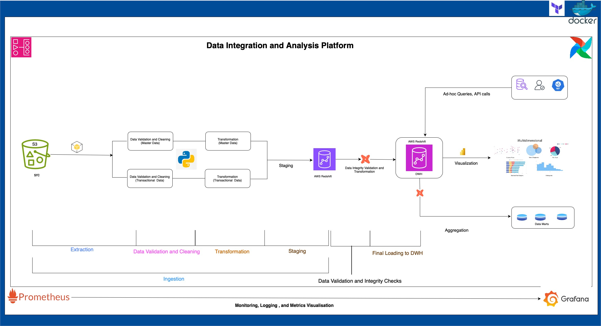

# Payroll Data Integration and Analysis Platform



## Overview

The Payroll Data Integration and Analysis Platform is designed to streamline payroll data management by integrating data from multiple sources, transforming and cleaning it to ensure accuracy and reliability. The system uses AWS S3 for raw data storage, Amazon Redshift as the data warehouse, and DBT for final transformations and schema validation. Prometheus and Grafana are utilized for monitoring and logging, providing deep insights into the data pipeline and its performance. This platform serves both public and enterprise-level consumers through APIs and secure data warehouse and data marts for reporting.

The entire platform is containerized using Docker, ensuring portability, consistency, and simplified deployment across different environments.

The cloud services like AWS S3 bucket, AWS Redshift Data Warehouse and all policies and permission for access are all managed by terraform (IaC- Infrastructure as a Code).

---

## Architecture

The platform is built using a **medallion architecture**, which provides a robust framework for managing the lifecycle of data as it transitions from raw to transformed and validated. The platform comprises the following layers:

1. **Bronze Layer (Raw Data Storage)**: 
   - **Storage**: AWS S3 (Configured via Terraform)
   - **Data**: Master files and transactional data files are uploaded here.
   - **Access Control**: Policies and permissions are enforced using AWS IAM roles.

2. **Silver Layer (Staging)**: 
   - **Process**: Python scripts are used to extract, validate, clean, and transform the data before it is ingested into the staging schema in Amazon Redshift.
   - **Staging Schema**: `stg` schema in Redshift contains cleaned and transformed data ready for further processing.

3. **Gold Layer (Enterprise Data Warehouse - EDW)**: 
   - **Process**: Final transformations, schema validations, and tests are executed by DBT.
   - **Data Models**: The validated data is loaded into the `edw` schema, ready for production use.
   - **Aggregation**: Data is also aggregated and supplied to data marts for specialized querying.

---

## Dimensional Modeling

The data warehouse is structured using a dimensional modeling approach to ensure efficient querying and reporting. Below are the key dimensions and fact tables that were designed based on stakeholder requirements:

### DimEmployee

| Column Name           | Data Type     |
|-----------------------|---------------|
| EmployeeID (PK)        | INT           |
| LastName              | VARCHAR(50)   |
| FirstName             | VARCHAR(50)   |
| LeaveStatusasofJune30 | VARCHAR(10)   |

### DimAgency

| Column Name      | Data Type     |
|------------------|---------------|
| AgencyID (PK)    | INT           |
| AgencyName       | VARCHAR(100)  |
| AgencyStartDate  | DATE          |

### DimTitle

| Column Name        | Data Type |
|--------------------|-----------|
| TitleCode (PK)      | INT       |
| TitleDescription    | TEXT      |

### FactPayroll

| Column Name             | Data Type     |
|-------------------------|---------------|
| PayrollID (PK)           | INT           |
| EmployeeID (FK)          | INT           |
| AgencyCode (FK)          | INT           |
| TitleCode (FK)           | INT           |
| FiscalYear               | INT           |
| PayrollNumber            | INT           |
| PayBasis                 | VARCHAR(50)   |
| WorkLocationBorough      | VARCHAR(20)   |
| RegularHours             | DECIMAL(10,2) |
| BaseSalary               | DECIMAL(10,2) |
| RegularGrossPaid         | DECIMAL(10,2) |
| OTHours                  | DECIMAL(10,2) |
| TotalOTPaid              | DECIMAL(10,2) |
| TotalOtherPaid           | DECIMAL(10,2) |

---

## Pipeline Workflow

The pipeline is designed to handle both master data and transactional data, treating them differently during the validation and transformation stages.

### 1. Extraction
- **Source**: S3 (Bronze Layer)
- **Files**: Master files (`EmpMaster.csv`, `TitleMaster.csv`, `AgencyMaster.csv`) and transactional files (`nycpayroll_2021.csv`, `nycpayroll_2020.csv`).
  
### 2. Data Validation and Cleaning
- **Master Data**: Each master file is validated and cleaned using a Python script specifically designed to handle its unique requirements (e.g., handling non-numeric fields in `TitleCode`).
- **Transactional Data**: Transactional data goes through its own validation process to ensure data consistency and integrity.

### 3. Transformation
- **Transformation Scripts**: Python scripts transform the validated data into a format suitable for staging.
  
### 4. Staging (Silver Layer)
- **Staging Area**: The cleaned and transformed data is ingested into the `stg` schema in Redshift.
  
### 5. Final Transformation (Gold Layer)
- **DBT**: DBT connects to the Redshift cluster, applying enterprise-level transformations, schema validation, and running tests to ensure data quality.
  
### 6. Loading and Aggregation
- **Production-Ready Data**: The final data is loaded into the `edw` schema, which is production-ready and accessible for analytics.
- **Data Marts**: Aggregated data is supplied to data marts for efficient querying and reporting.

---

## Monitoring and Logging

- **Prometheus**: The pipeline is integrated with Prometheus for real-time monitoring. Prometheus collects custom metrics such as total rows extracted, transformed, and ingested. Metrics are also collected for master and transactional data separately.
  
- **Grafana**: Grafana provides a visualization layer for the metrics collected by Prometheus, allowing stakeholders to view the performance of the pipeline in near real-time.

---

## Cost Efficiency

The platform is designed with cost efficiency in mind:

- **AWS S3**: The storage cost of raw data is minimized using S3, which offers flexible pricing options.
- **Redshift Spectrum**: Allows querying of raw data directly from S3, reducing storage costs in Redshift.
- **Containerization**: Using Docker containers reduces overhead by ensuring consistency across environments, allowing for efficient scaling when needed.
- **Optimized Transformations**: DBT transformations are executed in Redshift, leveraging its computational resources effectively to reduce load times.

---

## Setup and Configuration

### Prerequisites

- **Python**: Python 3.8+
- **AWS CLI**: For interaction with AWS services.
- **Terraform**: To deploy AWS infrastructure.
- **DBT**: To perform transformations on the data in Redshift.
- **Docker**: To run the platform in containers.

### Environment Variables

You will need to set the following environment variables for the pipeline to work correctly:

- `AWS_ACCESS_KEY_ID`: Your AWS Access Key.
- `AWS_SECRET_ACCESS_KEY`: Your AWS Secret Key.
- `AWS_DEFAULT_REGION`: The AWS region where your resources are located.
- `REDSHIFT_HOST`: The endpoint of the Redshift cluster.
- `REDSHIFT_DB`: The name of the Redshift database.
- `REDSHIFT_USER`: The Redshift username.
- `REDSHIFT_PASSWORD`: The Redshift password.

### Infrastructure Deployment

The AWS infrastructure is set up using Terraform. To deploy:

```bash
cd infrastructure
terraform init
terraform apply
```

This will deploy the following resources:

- An S3 bucket for raw data storage.
- An Amazon Redshift cluster for the data warehouse.
- IAM roles and policies for managing access to the S3 bucket and Redshift.

### Docker Setup

To containerize the entire platform, Docker is used. The Docker images are pre-configured with all necessary components to run the data pipeline. To build and run the Docker container:

```bash
docker-compose up --build
```

---

## Data Access

The final data warehouse can be accessed via:

1. **Ad-hoc Queries**: Directly through Amazon Redshift for enterprise users.
2. **API Calls**: A public API provides limited access to the data, protected by access controls to ensure security.
3. **Visualization**: Grafana dashboards are available for visual insights into the data, including multi-dimensional analysis using data marts.

---

## Recommendations for Future Improvements

- **Automation with Airflow**: Implement Apache Airflow for orchestration, providing better control over job scheduling and monitoring.
- **Data Governance**: Introduce tools like AWS Glue or Apache Atlas for better metadata management and lineage tracking.
- **Cost Monitoring**: Use AWS Cost Explorer or a third-party tool to monitor and optimize ongoing costs.
- **AI/ML Integration**: Incorporate machine learning pipelines for advanced analytics on payroll data.

---

## Conclusion

This Payroll Data Integration and Analysis Platform is a robust, scalable, and secure solution designed to handle complex payroll data processing, from extraction to transformation and final loading into a data warehouse. The platform supports real-time monitoring and is built to meet both enterprise and public user needs through efficient data management and visualization tools.

---

### References

- [Data Integration and Analysis Platform Architecture](./mnt/data/payroll_data_platform.jpg)
- [Dimensional Model](./mnt/data/diap-2.jpg)

1. Data Engineering

    ETL Pipelines: Designed and implemented Extract, Transform, and Load (ETL) pipelines, which are core to data engineering. This includes handling data extraction from S3, data transformation with custom logic, and loading data into Redshift.

    Data Quality: Implementing data validation and cleaning processes ensures the integrity and quality of data before loading it into a data warehouse.

    Data Modeling: Creating and managing fact and dimension tables indicates strong knowledge of data modeling practices.

2. DevOps

    Monitoring: By incorporating Prometheus for metrics collection and Grafana for visualization, this project established a robust monitoring system. This setup allows you to track the performance and health of ETL pipelines.

    Logging: Setting up ELK (Elasticsearch, Logstash, Kibana) for centralized logging captures and analyze logs from  ETL processes, which is crucial for troubleshooting and auditing.

    Alerting: The system includes mechanisms for alerting (via email and potentially other channels) based on log data and metrics. This ensures timely responses to issues that might affect the data pipeline.

    Automation: Using Apache Airflow for orchestration demonstrates a DevOps approach to automate the execution and management of your ETL workflows, making them more reliable and scalable.

3. Full-Stack Data Integration and Analysis Project

End-to-End Solution: This project integrates various components from data extraction to final validation and reporting, encompassing both data engineering and DevOps elements.
This approach ensures not only that data is processed correctly but also that the infrastructure supporting this process is monitored, logged, and alerting in real-time.

This project exemplifies a full-stack approach to data engineering and DevOps. It covers:

- Building robust data pipelines (ETL processes).
- Ensuring data quality and integrity.
- Implementing monitoring and alerting systems for operational efficiency.
- Using logging and metrics to maintain and troubleshoot the data infrastructure.

This comprehensive setup is aligned with industry best practices for managing enterprise-level data systems, highlighting your project's depth in both data engineering and operational management.

STEPS 

1. Setting out aims and objectives of the project to make sure it meet stakeholders requirements to the letter.
2. designing the project architecture and data flow for the etl 
3. Investigating the data and designing the dimensional model to fit the business requirements in accordance to the aims and objectives of the project.
4. Initializing terraform as iaC to manage aws cloud resources and services needed.
5. aws configure to set aws credentials like access key and security key through the CLI
6. terraform init, terraform plan, terraform apply. 
7. Cross-check the resources created and test it is viable and in accordance with your data model.
8. A python script is then used to create the data-warehouse tables as outlined int the dimensional model. The scrispt makes use of 'Redshift-data' which is an API that lets you connect directly to your redshift as long as the aws CLI is appropraitely configured.
NOTE: you have to give the right permission to the IAM role or user used so it allows connection to Redshift and the API which is 'redshift-data'
NOTE: Using redshift-data API is a modern approach and safer and will not expose any of your credentials..
9. Once that is done and verified, you can then head to creating the actual etl pipeline. 


# NOTES
NB: Make sure an internet Gateway is attached to the VPC used by the Redshift cluster. Otherwise the feature to turn public access of the redshift instance on will not work.
NB: Update the route table and add the IGW route and select the desitnation as public `0.0.0.0/0`

check the configurations are working : 
` nc -vz payroll-workgroup.637423632863.eu-west-2.redshift-serverless.amazonaws.com 5439`

### DBT INCREMENTAL LOADING 
The use of incremental models in dbt is specifically designed to address the need to avoid reloading or duplicating data that is already present in the data warehouse. Here’s how this approach ensures that data already in the data warehouse is not duplicated:
Key Concepts of Incremental Models

    Avoid Redundant Loads:
        Incremental Load: Instead of reloading the entire dataset every time the dbt run occurs, the incremental model only processes new or changed records since the last successful run.
        Incremental Strategy: This is achieved using strategies such as merge, insert_overwrite, or append. The example you provided uses the merge strategy.

    Unique Key:
        Identification: The unique_key parameter (e.g., EmployeeID in your example) is used to identify records uniquely. This ensures that only records with unique keys are inserted or updated.
        Conflict Resolution: During incremental updates, if a record with the same unique key already exists in the target table, it is updated with the latest data.

    Incremental Logic:

        Filtering Existing Records: The is_incremental() conditional block helps to filter out records that already exist in the target table. For example:

        sql


    where EmployeeID not in (select EmployeeID from {{ this }})


Avoid Duplication: This logic ensures that only new records are added, and existing records are not reprocessed, thereby preventing duplication.

# Reccomendation: 
Domain-Specific Thresholds to handle outliers:

Consider setting business rules or thresholds based on domain knowledge (e.g., minimum wage, expected salary ranges) rather than relying solely on statistical outliers.
combining statistical methods with business logic and potentially manual review is advisable for accurate data quality handling.